# Worker Email Notifier

[](https://opensource.org/licenses/MIT)
[](https://nodejs.org/)
[](https://workers.cloudflare.com/)

> 🌏 [繁體中文](README.zh-TW.md)

> 🚀 Zero-cost, high-performance multi-platform email notification service built on Cloudflare Workers and Email Routing

Easily add email notifications to your apps, websites, and IoT devices. No mail server management, no SMTP configuration—just a simple REST API call.

---

## 📋 Use Cases

This project is designed for **internal notification emails**, not for sending emails to external users.

**Ideal for:**
- System monitoring alerts (server down, high CPU, etc.)
- Application event notifications (new order, payment received, etc.)
- CI/CD pipeline notifications
- IoT device alerts
- Internal team notifications
- Website "Contact Us" form submissions

**NOT suitable for:**
- Marketing emails or newsletters
- User-to-user messaging
- Transactional emails to arbitrary external users
- High-volume email campaigns

> The recipient whitelist design ensures emails can only be sent to pre-approved addresses, making it secure for internal use.

---

## ⚠️ Prerequisites

Before using this project, ensure you have:

| Requirement | Description |
|-------------|-------------|
| **Custom Domain** | A domain added to Cloudflare (can be registered elsewhere) |
| **Email Routing Enabled** | Enable Email Routing on your domain in Cloudflare Dashboard |
| **Node.js** | Version 18.0.0 or higher |

### Enabling Email Routing

1. Go to **Cloudflare Dashboard** > Select your domain
2. Navigate to **Email** > **Email Routing**
3. Click **Get started** and follow the setup wizard
4. Add the required DNS records (MX, TXT) when prompted
5. Wait for DNS propagation (usually a few minutes)

> **Note**: Email Routing is free and included with all Cloudflare plans.

---

## ✨ Features

| Feature | Description |
|---------|-------------|
| 🏢 **Multi-Platform Support** | Independent sender, recipient whitelist, and API key per platform |
| 🔐 **Security First** | Constant-time API key comparison, input validation, XSS protection |
| 📧 **Flexible Recipients** | Whitelist any email address (Gmail, Slack, PagerDuty...) |
| ⚡ **Zero Cold Start** | Runs on Cloudflare Workers global edge network |
| 💰 **Free Tier** | 100,000 requests/day, 1,000 emails/day free |
| 🚫 **No Third-Party Services** | No need to pay for Resend, Postmark, SendGrid, SES, etc. for small projects |

---

## 🚀 Quick Start

```bash
# 1. Clone the project
git clone https://github.com/supra126/worker-email-notifier.git
cd worker-email-notifier

# 2. Install dependencies
npm install

# 3. Copy and edit config
cp wrangler.toml.example wrangler.toml
# Edit wrangler.toml with your domains and recipients

# 4. Login to Cloudflare (if not already logged in)
wrangler login

# 5. Generate and set API Key
npm run generate-key
wrangler secret put API_KEY

# 6. Deploy
npm run deploy
```

After deployment, you'll get an API endpoint: `https://email-notifier.<your-subdomain>.workers.dev`

---

## 📨 Usage Example

```bash
curl -X POST https://email-notifier.<your-subdomain>.workers.dev \
  -H "Content-Type: application/json" \
  -H "X-API-Key: your-api-key" \
  -d '{
    "platformId": "platform-a",
    "to": "admin@gmail.com",
    "subject": "🔔 System Notification",
    "content": "This is a notification from your application"
  }'
```

---

## 📖 Table of Contents

- [Use Cases](#use-cases)
- [Prerequisites](#prerequisites)
- [Features](#features-1)
- [Security Features](#security-features)
- [Architecture](#architecture)
- [Deployment](#deployment)
- [API Reference](#api-reference)
- [Adding Platforms](#adding-platforms)
- [Environment Variables](#environment-variables)
- [Local Development](#local-development)
- [Security Analysis](#security-analysis)
- [Rate Limiting](#rate-limiting-optional)
- [Notes](#notes)
- [Author](#author)
- [License](#license)

---

## Features

- RESTful API interface
- **Multi-platform support**: Each platform has independent sender and recipient whitelist
- **Flexible API Key**: Supports platform-specific or shared API keys
- HTML and plain text email support
- Multiple recipients (up to 50)
- CORS support (single or multiple origins)
- Rate limiting (optional)
- Input validation and length limits

## Security Features

- **Constant-time API key comparison**: Prevents timing attacks
- **Content-Type validation**: Only accepts `application/json`
- **Rate limiting**: Configurable via Cloudflare Dashboard (WAF > Rate limiting rules)
- **CORS origin validation**: Restrict access to specific domains
- **Recipient whitelist**: Each platform can only send to its own `allowed_destination_addresses` (any domain)
- **Input length limits**: Subject 500 chars, content 100,000 chars, 50 recipients max
- **Email validation**: RFC 5322 compliant
- **Error message sanitization**: Removes sensitive information
- **HTML escaping**: Prevents XSS attacks

## Architecture


### Request Flow


### Sender vs Recipient

| Item | Description | Domain Restriction |
|------|-------------|-------------------|
| **Sender** (`senderEmail`) | Email From address | Must be a domain with Cloudflare Email Routing enabled |
| **Recipients** (`allowed_destination_addresses`) | Allowed recipient whitelist | Any domain, but must be verified in Email Routing |

```mermaid
flowchart LR
    subgraph Sender
        S["noreply#64;your-domain.com<br/>Must be Cloudflare domain"]
    end

    subgraph Whitelist[Recipient Whitelist]
        R1["boss#64;gmail.com ✅"]
        R2["admin#64;company.com ✅"]
        R3["alerts#64;slack.com ✅"]
    end

    S --> R1
    S --> R2
    S --> R3
    S -.->|Not in whitelist| R4["random#64;unknown.com ❌"]
```



## Deployment

### 1. Install Dependencies

```bash
npm install
```

### 2. Configure Platforms

Copy the example config and edit:

```bash
cp wrangler.toml.example wrangler.toml
```

Edit `wrangler.toml`:

```toml
# Platform A's recipient whitelist (can be any domain)
[[send_email]]
name = "MAILER_A"
allowed_destination_addresses = [
  "boss@gmail.com",
  "admin@company.com",
  "alerts@slack.com"
]

# Platform B's recipient whitelist
[[send_email]]
name = "MAILER_B"
allowed_destination_addresses = [
  "dev-team@gmail.com",
  "ops@pagerduty.com",
  "support@external-partner.com"
]

# Platform config (native TOML)
# senderEmail must be a domain with Cloudflare Email Routing enabled

[vars.PLATFORMS.platform-a]
senderEmail = "noreply@your-domain.com"
senderName = "Platform A Notifications"
mailer = "MAILER_A"

[vars.PLATFORMS.platform-b]
senderEmail = "noreply@your-domain.com"
senderName = "Platform B Notifications"
mailer = "MAILER_B"
```

> **Note**: `senderEmail` must use a domain with Cloudflare Email Routing enabled. `allowed_destination_addresses` can be any domain (Gmail, company email, Slack, etc.), but each address must be verified in Cloudflare Email Routing first.

### 3. Set API Key

Generate a secure API key:

```bash
npm run generate-key
```

**Option 1: Shared API Key (all platforms)**

```bash
wrangler secret put API_KEY
# Paste the generated API key
```

**Option 2: Platform-specific API Keys**

```bash
wrangler secret put API_KEYS
# Enter JSON format: {"platform-a": "key-for-a", "platform-b": "key-for-b"}
```

**Option 3: Mixed**

Set both `API_KEY` and `API_KEYS`. The system checks platform-specific key first, then shared key.

### 4. Deploy

```bash
npm run deploy
```

## API Reference

### Endpoint

**POST** `https://email-notifier.<your-subdomain>.workers.dev`

### Request Headers

| Header | Required | Description |
|--------|----------|-------------|
| `Content-Type` | Yes | Must be `application/json` |
| `X-API-Key` | Yes | Platform-specific or shared API key |

### Request Body

| Field | Type | Required | Limit | Description |
|-------|------|----------|-------|-------------|
| `platformId` | `string` | Yes | - | Platform identifier (matches PLATFORMS config) |
| `to` | `string` or `string[]` | Yes | Max 50 | Recipients (must be in platform whitelist) |
| `subject` | `string` | Yes | Max 500 chars | Email subject |
| `content` | `string` | No* | Max 100,000 chars | Plain text content |
| `html` | `string` | No* | Max 100,000 chars | HTML content |

> *At least one of `content` or `html` is required

### Request Examples

**Platform A sending to Gmail:**

```bash
curl -X POST https://email-notifier.<your-subdomain>.workers.dev \
  -H "Content-Type: application/json" \
  -H "X-API-Key: platform-a-api-key" \
  -d '{
    "platformId": "platform-a",
    "to": "boss@gmail.com",
    "subject": "Notification from Platform A",
    "content": "This is test content"
  }'
```

**Platform B sending HTML email to multiple recipients:**

```bash
curl -X POST https://email-notifier.<your-subdomain>.workers.dev \
  -H "Content-Type: application/json" \
  -H "X-API-Key: platform-b-api-key" \
  -d '{
    "platformId": "platform-b",
    "to": ["dev-team@gmail.com", "ops@pagerduty.com"],
    "subject": "Notification from Platform B",
    "html": "<h1>Important Notice</h1><p>This is an HTML email</p>",
    "content": "This is the plain text version (fallback)"
  }'
```

**Using shared API Key:**

```bash
curl -X POST https://email-notifier.<your-subdomain>.workers.dev \
  -H "Content-Type: application/json" \
  -H "X-API-Key: shared-api-key" \
  -d '{
    "platformId": "platform-a",
    "to": "admin@company.com",
    "subject": "Test",
    "content": "Sending with shared key"
  }'
```

### Response Format

**Success:**
```json
{
  "success": true,
  "message": "Email sent: 1 success, 0 failed",
  "platform": "platform-a",
  "details": [
    { "to": "boss@gmail.com", "status": "fulfilled" }
  ]
}
```

**Partial Success:**
```json
{
  "success": true,
  "message": "Email sent: 1 success, 1 failed",
  "platform": "platform-b",
  "details": [
    { "to": "dev-team@gmail.com", "status": "fulfilled" },
    { "to": "ops@pagerduty.com", "status": "rejected", "error": "Email sending failed" }
  ]
}
```

**Error:**
```json
{
  "error": "Error message"
}
```

### HTTP Status Codes

| Code | Description |
|------|-------------|
| 200 | At least one email sent successfully |
| 400 | Request parameter error (including invalid platformId) |
| 401 | API Key authentication failed |
| 403 | CORS origin not allowed |
| 405 | HTTP method not supported |
| 415 | Incorrect Content-Type |
| 500 | Server error or all emails failed |

### Error Messages

| Error Message | Code | Description |
|---------------|------|-------------|
| `Method not allowed` | 405 | Used method other than POST |
| `Content-Type must be application/json` | 415 | Wrong Content-Type |
| `Origin not allowed` | 403 | CORS origin not in allow list |
| `Missing required field: platformId` | 400 | Missing platformId |
| `Invalid platformId: xxx` | 400 | platformId doesn't exist |
| `Unauthorized` | 401 | Wrong API Key |
| `Missing required fields: to, subject, and content or html` | 400 | Missing required fields |
| `Field 'subject' must be a string` | 400 | Wrong subject type |
| `Field 'content' must be a string` | 400 | Wrong content type |
| `Field 'html' must be a string` | 400 | Wrong html type |
| `Subject exceeds maximum length` | 400 | Subject too long |
| `Invalid email address format` | 400 | Invalid email format |
| `Platform configuration error` | 500 | Platform config error |

## Adding Platforms

### Steps

1. **Add `[[send_email]]` block** (define recipient whitelist)

```toml
[[send_email]]
name = "MAILER_C"
# Recipients can be any domain
allowed_destination_addresses = [
  "cto@gmail.com",
  "team@notion.so",
  "alerts@opsgenie.com"
]
```

2. **Add platform config in `PLATFORMS`**

```toml
[vars.PLATFORMS.platform-c]
senderEmail = "noreply@your-domain.com"
senderName = "Platform C Notifications"
mailer = "MAILER_C"
```

> `senderEmail` must be your Cloudflare domain, but `allowed_destination_addresses` can be any email address.

3. **Set API Key (choose one)**

```bash
# Option 1: Add to shared key (skip if already set)
wrangler secret put API_KEY

# Option 2: Update platform-specific keys
wrangler secret put API_KEYS
# Enter: {"platform-a": "...", "platform-b": "...", "platform-c": "new-key"}
```

4. **Redeploy**

```bash
npm run deploy
```

## Environment Variables

| Variable | Required | Description |
|----------|----------|-------------|
| `PLATFORMS` | Yes | Platform config (native TOML or JSON) |
| `API_KEY` | No* | Shared API key |
| `API_KEYS` | No* | Platform-specific API keys (JSON format) |
| `CORS_ORIGIN` | No | Single CORS origin |
| `CORS_ORIGINS` | No | Multiple CORS origins (comma-separated) |

> *At least one of `API_KEY` or `API_KEYS` is required

## Local Development

```bash
npm run dev
```

For testing, set environment variables in `.dev.vars`:

```
API_KEY=test-api-key
```

## Security Analysis

### Multi-Platform Isolation

| Protection | Description |
|------------|-------------|
| Independent recipient whitelist | Platform A cannot send to Platform B's recipients |
| Independent API Key (optional) | Platform A's key cannot operate Platform B |
| Independent sender | Each platform uses different sender address |

### API Key Strategy Recommendations

| Strategy | Use Case | Pros | Cons |
|----------|----------|------|------|
| Shared Key | All platforms managed by same team | Simple | Leak affects all platforms |
| Platform-specific Keys | Different teams/customers | Security isolation | More complex management |
| Mixed | Internal shared, external specific | Flexible | Requires careful planning |

### Best Practices

1. **API Key Management**
   - Never include in frontend code
   - Only call this API from backend servers
   - Rotate keys regularly

2. **Recipient Whitelist**
   - Only add necessary email addresses
   - Regularly review and remove unused addresses

3. **Monitoring**
   - Use Cloudflare Analytics to monitor traffic
   - Watch for unusual sending volumes

## Rate Limiting (Optional)

To limit API request frequency, configure via Cloudflare Dashboard:

1. Go to **Cloudflare Dashboard** > Select your domain
2. Go to **Security** > **WAF** > **Rate limiting rules**
3. Click **Create rule**
4. Configure rule, for example:
   - **Rule name**: `Email API Rate Limit`
   - **If incoming requests match**: `URI Path equals /` or custom path
   - **Rate limit**: `10 requests per 1 minute`
   - **Action**: `Block`

Benefits of this approach:
- No code required
- No KV storage needed
- Native Cloudflare feature, better performance
- Supports complex rules (by IP, country, User Agent, etc.)

## Notes

- **Sender** (`senderEmail`) must be a domain with Cloudflare Email Routing enabled
- **Recipients** (`allowed_destination_addresses`) can be **any domain** (Gmail, company email, Slack, PagerDuty, etc.), but must be verified in Email Routing
- Recipients only need to be in the corresponding platform's whitelist, no domain restrictions
- Keep API Keys secure, don't commit to version control
- Recommended to call this API from backend, not frontend
- `platformId` appears at the beginning of emails as source tag

---

## Author

<a href="https://github.com/supra126">
  
</a>

**黃小黃** ([@supra126](https://github.com/supra126))

---

## License

[MIT License](LICENSE.txt)
