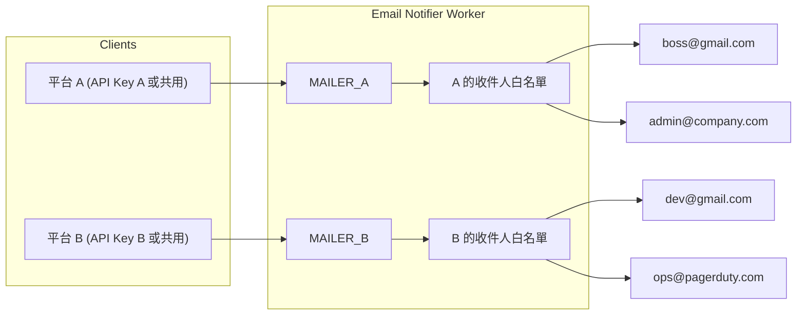
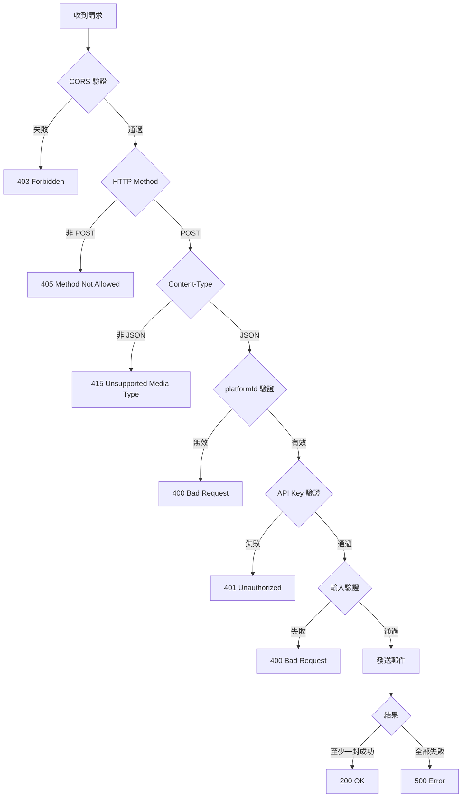
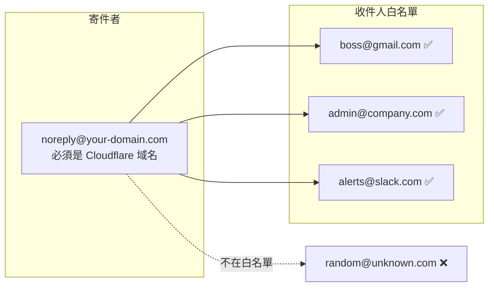

# Worker Email Notifier

[](https://opensource.org/licenses/MIT)
[](https://nodejs.org/)
[](https://workers.cloudflare.com/)

> 🌏 [English](README.md)

> 🚀 零成本、高效能的多平台郵件通知服務，基於 Cloudflare Workers 和 Email Routing

輕鬆為你的應用程式、網站、IoT 設備添加郵件通知功能。無需管理郵件伺服器，無需 SMTP 設定，只需簡單的 REST API 呼叫。

---

## 📋 使用場景

本專案設計用於**對內通知信**，而非對外發送郵件給一般用戶。

**適合用於：**
- 系統監控警報（伺服器異常、CPU 過高等）
- 應用程式事件通知（新訂單、收到付款等）
- CI/CD 流程通知
- IoT 設備警報
- 內部團隊通知
- 網站「聯絡我們」表單

**不適合用於：**
- 行銷郵件或電子報
- 用戶對用戶的訊息傳遞
- 對任意外部用戶發送交易郵件
- 大量郵件發送

> 收件人白名單設計確保郵件只能發送到預先核准的地址，適合內部使用且更加安全。

---

## ⚠️ 前置需求

使用本專案前，請確保你已具備：

| 需求 | 說明 |
|------|------|
| **自訂域名** | 已加入 Cloudflare 的域名（可在其他註冊商註冊） |
| **啟用 Email Routing** | 在 Cloudflare Dashboard 啟用域名的 Email Routing |
| **Node.js** | 版本 18.0.0 以上 |

### 啟用 Email Routing

1. 前往 **Cloudflare Dashboard** > 選擇你的域名
2. 前往 **Email** > **Email Routing**
3. 點選 **Get started** 並依照設定精靈操作
4. 依提示新增必要的 DNS 記錄（MX、TXT）
5. 等待 DNS 生效（通常幾分鐘內）

> **注意**：Email Routing 是免費功能，所有 Cloudflare 方案皆可使用。

---

## ✨ 特色

| 功能 | 說明 |
|------|------|
| 🏢 **多平台支援** | 每個平台獨立的寄件者、收件人白名單、API Key |
| 🔐 **安全優先** | 常數時間 API Key 比較、輸入驗證、XSS 防護 |
| 📧 **彈性收件人** | 白名單可設定任何郵件地址（Gmail、Slack、PagerDuty...） |
| ⚡ **零冷啟動** | Cloudflare Workers 全球邊緣運行 |
| 💰 **免費額度** | 每日 100,000 次請求、1,000 封郵件免費 |
| 🚫 **無需第三方服務** | 不必為了小專案租用 Resend、Postmark、SendGrid、SES...等 |

---

## 🚀 快速開始

```bash
# 1. Clone 專案
git clone https://github.com/supra126/worker-email-notifier.git
cd worker-email-notifier

# 2. 安裝依賴
npm install

# 3. 複製並編輯設定檔
cp wrangler.toml.example wrangler.toml
# 編輯 wrangler.toml，填入你的域名和收件人

# 4. 登入 Cloudflare（如果還沒登入）
wrangler login

# 5. 產生並設定 API Key
npm run generate-key
wrangler secret put API_KEY

# 6. 部署
npm run deploy
```

部署完成後，你會得到一個 API 端點：`https://email-notifier.<your-subdomain>.workers.dev`

---

## 📨 使用範例

```bash
curl -X POST https://email-notifier.<your-subdomain>.workers.dev \
  -H "Content-Type: application/json" \
  -H "X-API-Key: your-api-key" \
  -d '{
    "platformId": "platform-a",
    "to": "admin@gmail.com",
    "subject": "🔔 系統通知",
    "content": "這是來自你的應用程式的通知"
  }'
```

---

## 📖 目錄

- [使用場景](#使用場景)
- [前置需求](#前置需求)
- [功能](#功能)
- [安全特性](#安全特性)
- [架構說明](#架構說明)
- [部署步驟](#部署步驟)
- [API 使用](#api-使用)
- [新增平台](#新增平台)
- [環境變數](#環境變數)
- [本地開發](#本地開發)
- [安全性分析](#安全性分析)
- [速率限制](#速率限制選用)
- [注意事項](#注意事項)
- [作者](#作者)
- [授權](#授權)

---

## 功能

- RESTful API 介面
- **多平台支援**：每個平台有獨立的寄件者和收件人白名單
- **彈性 API Key**：支援平台專屬 Key 或共用 Key
- 支援 HTML 和純文字郵件
- 支援多收件人（最多 50 人）
- CORS 支援（可設定單一或多個來源）
- 速率限制（選用）
- 輸入驗證與長度限制

## 安全特性

- **常數時間 API Key 比較**：防止時序攻擊
- **Content-Type 驗證**：僅接受 `application/json`
- **速率限制**：可透過 Cloudflare Dashboard 設定（WAF > Rate limiting rules）
- **CORS 來源驗證**：可限制特定域名存取
- **收件人白名單**：每個平台只能發送到各自的 `allowed_destination_addresses`（可以是任何域名）
- **輸入長度限制**：主旨 500 字元、內容 100,000 字元、收件人 50 人
- **郵件地址驗證**：RFC 5322 相容
- **錯誤訊息清理**：移除敏感資訊
- **HTML 跳脫**：防止 XSS 攻擊

## 架構說明



### 請求處理流程



### 寄件者 vs 收件人

| 項目 | 說明 | 域名限制 |
|------|------|----------|
| **寄件者** (`senderEmail`) | 郵件的 From 地址 | 必須是你在 Cloudflare 啟用 Email Routing 的域名 |
| **收件人** (`allowed_destination_addresses`) | 允許接收郵件的白名單 | 任何域名，但須在 Email Routing 中通過驗證 |



## 部署步驟

### 1. 安裝依賴

```bash
npm install
```

### 2. 設定平台

複製範例設定檔並編輯：

```bash
cp wrangler.toml.example wrangler.toml
```

編輯 `wrangler.toml`：

```toml
# 平台 A 的收件人白名單（可以是任何域名的郵件地址）
[[send_email]]
name = "MAILER_A"
allowed_destination_addresses = [
  "boss@gmail.com",
  "admin@company.com",
  "alerts@slack.com"
]

# 平台 B 的收件人白名單
[[send_email]]
name = "MAILER_B"
allowed_destination_addresses = [
  "dev-team@gmail.com",
  "ops@pagerduty.com",
  "support@external-partner.com"
]

# 平台設定（原生 TOML 格式）
# senderEmail 必須是你在 Cloudflare 啟用 Email Routing 的域名

[vars.PLATFORMS.platform-a]
senderEmail = "noreply@your-domain.com"
senderName = "平台 A 通知"
mailer = "MAILER_A"

[vars.PLATFORMS.platform-b]
senderEmail = "noreply@your-domain.com"
senderName = "平台 B 通知"
mailer = "MAILER_B"
```

> **注意**：`senderEmail` 必須使用你在 Cloudflare 啟用 Email Routing 的域名。`allowed_destination_addresses` 可以是任何域名（Gmail、公司郵件、Slack 等），但每個地址都必須先在 Cloudflare Email Routing 中通過驗證。

### 3. 設定 API Key

產生安全的 API Key：

```bash
npm run generate-key
```

**方式一：共用 API Key（所有平台共用）**

```bash
wrangler secret put API_KEY
# 貼上產生的 API Key
```

**方式二：各平台獨立 API Key**

```bash
wrangler secret put API_KEYS
# 輸入 JSON 格式：{"platform-a": "key-for-a", "platform-b": "key-for-b"}
```

**方式三：混合使用**

同時設定 `API_KEY` 和 `API_KEYS`，系統會先檢查平台專屬 Key，再檢查共用 Key。

### 4. 部署

```bash
npm run deploy
```

## API 使用

### 端點

**POST** `https://email-notifier.<your-subdomain>.workers.dev`

### 請求標頭

| 標頭 | 必填 | 說明 |
|------|------|------|
| `Content-Type` | 是 | 必須為 `application/json` |
| `X-API-Key` | 是 | 平台專屬或共用 API 金鑰 |

### 請求 Body 欄位

| 欄位 | 類型 | 必填 | 限制 | 說明 |
|------|------|------|------|------|
| `platformId` | `string` | 是 | - | 平台識別碼（對應 PLATFORMS 設定） |
| `to` | `string` 或 `string[]` | 是 | 最多 50 個 | 收件人（必須在該平台白名單中） |
| `subject` | `string` | 是 | 最長 500 字元 | 郵件主旨 |
| `content` | `string` | 否* | 最長 100,000 字元 | 純文字內容 |
| `html` | `string` | 否* | 最長 100,000 字元 | HTML 格式內容 |

> *`content` 和 `html` 至少需提供一個

### 請求範例

**平台 A 發送郵件給 Gmail 用戶：**

```bash
curl -X POST https://email-notifier.<your-subdomain>.workers.dev \
  -H "Content-Type: application/json" \
  -H "X-API-Key: platform-a-api-key" \
  -d '{
    "platformId": "platform-a",
    "to": "boss@gmail.com",
    "subject": "來自平台 A 的通知",
    "content": "這是測試內容"
  }'
```

**平台 B 發送 HTML 郵件給多位收件人（不同域名）：**

```bash
curl -X POST https://email-notifier.<your-subdomain>.workers.dev \
  -H "Content-Type: application/json" \
  -H "X-API-Key: platform-b-api-key" \
  -d '{
    "platformId": "platform-b",
    "to": ["dev-team@gmail.com", "ops@pagerduty.com"],
    "subject": "來自平台 B 的通知",
    "html": "<h1>重要通知</h1><p>這是 HTML 格式的郵件</p>",
    "content": "這是純文字版本（作為 fallback）"
  }'
```

**使用共用 API Key：**

```bash
curl -X POST https://email-notifier.<your-subdomain>.workers.dev \
  -H "Content-Type: application/json" \
  -H "X-API-Key: shared-api-key" \
  -d '{
    "platformId": "platform-a",
    "to": "admin@company.com",
    "subject": "測試",
    "content": "使用共用 Key 發送"
  }'
```

### 回應格式

**成功：**
```json
{
  "success": true,
  "message": "Email sent: 1 success, 0 failed",
  "platform": "platform-a",
  "details": [
    { "to": "boss@gmail.com", "status": "fulfilled" }
  ]
}
```

**部分成功：**
```json
{
  "success": true,
  "message": "Email sent: 1 success, 1 failed",
  "platform": "platform-b",
  "details": [
    { "to": "dev-team@gmail.com", "status": "fulfilled" },
    { "to": "ops@pagerduty.com", "status": "rejected", "error": "Email sending failed" }
  ]
}
```

**錯誤：**
```json
{
  "error": "錯誤訊息"
}
```

### HTTP 狀態碼

| 狀態碼 | 說明 |
|--------|------|
| 200 | 至少一封郵件發送成功 |
| 400 | 請求參數錯誤（含無效的 platformId） |
| 401 | API Key 驗證失敗 |
| 403 | CORS 來源不被允許 |
| 405 | 不支援的 HTTP 方法 |
| 415 | Content-Type 不正確 |
| 500 | 伺服器錯誤或所有郵件發送失敗 |

### 錯誤訊息列表

| 錯誤訊息 | 狀態碼 | 說明 |
|----------|--------|------|
| `Method not allowed` | 405 | 使用了 POST 以外的方法 |
| `Content-Type must be application/json` | 415 | Content-Type 錯誤 |
| `Origin not allowed` | 403 | CORS 來源不在允許清單 |
| `Missing required field: platformId` | 400 | 缺少 platformId |
| `Invalid platformId: xxx` | 400 | platformId 不存在 |
| `Unauthorized` | 401 | API Key 錯誤 |
| `Missing required fields: to, subject, and content or html` | 400 | 缺少必要欄位 |
| `Field 'subject' must be a string` | 400 | subject 欄位類型錯誤 |
| `Field 'content' must be a string` | 400 | content 欄位類型錯誤 |
| `Field 'html' must be a string` | 400 | html 欄位類型錯誤 |
| `Subject exceeds maximum length` | 400 | 主旨過長 |
| `Invalid email address format` | 400 | 郵件格式錯誤 |
| `Platform configuration error` | 500 | 平台設定錯誤 |

## 新增平台

### 步驟

1. **新增 `[[send_email]]` 區塊**（定義收件人白名單）

```toml
[[send_email]]
name = "MAILER_C"
# 收件人可以是任何域名
allowed_destination_addresses = [
  "cto@gmail.com",
  "team@notion.so",
  "alerts@opsgenie.com"
]
```

2. **在 `PLATFORMS` 中新增平台設定**

```toml
[vars.PLATFORMS.platform-c]
senderEmail = "noreply@your-domain.com"
senderName = "平台 C 通知"
mailer = "MAILER_C"
```

> `senderEmail` 必須是你的 Cloudflare 域名，但 `allowed_destination_addresses` 可以是任何郵件地址。

3. **設定 API Key（選擇一種方式）**

```bash
# 方式一：加入共用 Key（已有則跳過）
wrangler secret put API_KEY

# 方式二：更新平台專屬 Keys
wrangler secret put API_KEYS
# 輸入：{"platform-a": "...", "platform-b": "...", "platform-c": "new-key"}
```

4. **重新部署**

```bash
npm run deploy
```

## 環境變數

| 變數 | 必填 | 說明 |
|------|------|------|
| `PLATFORMS` | 是 | 平台設定（原生 TOML 或 JSON） |
| `API_KEY` | 否* | 共用 API 金鑰 |
| `API_KEYS` | 否* | 平台專屬 API 金鑰（JSON 格式） |
| `CORS_ORIGIN` | 否 | 單一 CORS 來源 |
| `CORS_ORIGINS` | 否 | 多個 CORS 來源（逗號分隔） |

> *`API_KEY` 和 `API_KEYS` 至少需設定一個

## 本地開發

```bash
npm run dev
```

測試時需要在 `.dev.vars` 中設定環境變數：

```
API_KEY=test-api-key
```

## 安全性分析

### 多平台隔離

| 保護機制 | 說明 |
|----------|------|
| 獨立收件人白名單 | 平台 A 無法發送到平台 B 的收件人 |
| 獨立 API Key（選用） | 平台 A 的 Key 無法操作平台 B |
| 獨立寄件者 | 每個平台使用不同的寄件地址 |

### API Key 策略建議

| 策略 | 適用場景 | 優點 | 缺點 |
|------|----------|------|------|
| 共用 Key | 所有平台由同一團隊管理 | 簡單 | 洩漏影響所有平台 |
| 各平台獨立 Key | 不同團隊/客戶使用 | 安全隔離 | 管理較複雜 |
| 混合使用 | 內部用共用、外部用獨立 | 彈性 | 需仔細規劃 |

### 最佳實踐

1. **API Key 管理**
   - 永遠不要寫在前端程式碼中
   - 只在後端伺服器呼叫此 API
   - 定期輪換 Key

2. **收件人白名單**
   - 只加入必要的郵件地址
   - 定期檢視並移除不需要的地址

3. **監控**
   - 使用 Cloudflare Analytics 監控流量
   - 注意異常的發送量

## 速率限制（選用）

如需限制 API 請求頻率，可透過 Cloudflare Dashboard 設定：

1. 前往 **Cloudflare Dashboard** > 選擇你的網域
2. 前往 **Security** > **WAF** > **Rate limiting rules**
3. 點選 **Create rule**
4. 設定規則，例如：
   - **Rule name**: `Email API Rate Limit`
   - **If incoming requests match**: `URI Path equals /` 或自訂路徑
   - **Rate limit**: `10 requests per 1 minute`
   - **Action**: `Block`

這種方式的優點：
- 不需要寫程式碼
- 不需要 KV 儲存
- Cloudflare 原生功能，效能更好
- 支援更複雜的規則（依 IP、國家、User Agent 等）

## 注意事項

- **寄件者** (`senderEmail`) 必須是你在 Cloudflare 啟用 Email Routing 的域名
- **收件人** (`allowed_destination_addresses`) 可以是**任何域名**（Gmail、公司郵件、Slack、PagerDuty 等），但須在 Email Routing 中通過驗證
- 收件人只需在對應平台的白名單中，無域名限制
- API Key 請妥善保管，不要提交到版本控制
- 建議從後端呼叫此 API，而非前端
- `platformId` 會顯示在郵件開頭作為來源標記

---

## 作者

<a href="https://github.com/supra126">
  
</a>

**黃小黃** ([@supra126](https://github.com/supra126))

---

## 授權

[MIT License](LICENSE.txt)

